# js-monads

here we are going to take a look at a few monads

lets create a folder in our programming folder and call it js-monads

bring up the command prompt in the folder and type

```js
npx kreat
```

you should see this:


Im choosing javascript playground for this repo. then just answer the questions for if you want as git repo and if you want to install the dependencies. I would suggest at least for installing the dependencies as you are going to have to do that at some point.

now you can open that project in vscode.

now lets bring up the terminal and type 

```js
npm start
```

you should be presented with this in the console after webpack starts up


## branch 1

### Maybe monad

lets firt start with a problem. say we had this code:

```js
const a = {
  b: {
    c: 'my code',
  },
};

const appendString = (obj) => obj.b.c + ' works properly';
const result = appendString(a);
console.log(result);

```

save it and your web console should look like this:


now what happens if say we remove c

```js
const a = {
  b: {},
};
```

ok, it doesnt entirely break, but it looks kind of strange, right:


if we ask a for is b child, now problem, but when we ask b for its c child its just undefined and thats actually not really a problem per say. the code will still work, you just wont get the wished for outcome, right?

now, what happens if we remove b

```js
const a = {};
```

ok, now we really have a problem:


if we ask a for its b child, its not there. no problem. but if we try to ask b for its c child, well, b is not there and therefore has no children so things will start to blow up.

so, how do we solve for this problem? bring in the Maybe monad.

lets create a file called Maybe.js

we are first going to start out with some helper functions

```js
const isNullOrUndef = (v) => v === null || typeof v === 'undefined';

const maybe = (x) => ({
  isNothing: () => isNullOrUndef(x),
  extract: () => x
})
```

lets start out with a simple factory function like so:

```js
export const Maybe = {
  just: maybe,
  nothing: () => maybe(null),
};
```

we will start with that and then come back later and add some more functions to it.

first let's test it out and see if everything works, so in our index.js file, lets add this:

at the top of the file, lets import our Maybe function

```js
import { Maybe } from './Maybe';
```

then ad the end of the file, lets write some testing code

```js
const maybeNumberOne = Maybe.just(1);
const maybeNumberTwo = Maybe.nothing();

console.log('maybe.just is nothing?', maybeNumberOne.isNothing());
console.log('maybe.nothing is nothing?', maybeNumberTwo.isNothing());
```

now we should see this in our console.


lets commit what we have so far, and we'll continue in the next branch.

## branch 2

lets get rid of this code, but we'll come back to it later

```js
const a = {
  b: {
    c: 'my code',
  },
};

const appendString = (obj) => obj.b.c + ' works properly';
const result = appendString(a);
console.log(result);
```

now lets add some functionality to this maybe character so we can actually start to do things

```js
const maybe = (x) => ({
  isNothing: () => isNullOrUndef(x),
  extract: () => x,
  map: (f) => (!isNullOrUndef(x) ? Maybe.just(f(x)) : Maybe.nothing()),
});
```

so when we map, if there is something thats mappable, we just return a new maybe and execute the map function of the value that the maybe is holding for us. if the value inside the maybe cant be mapped, we just return a nothing, so this way, nothing ever breaks

now let's modify our testing like so:

```js
const maybeNumberOne = Maybe.just(1);
const mappedJust = maybeNumberOne.map((x) => x + 1);
console.log(mappedJust.extract());

const maybeNumberTwo = Maybe.nothing();
const mappedNothing = maybeNumberTwo.map((x) => x + 1);
console.log(mappedNothing.extract());
```

and then lets remove this code

```js
console.log('maybe.just is nothing?', maybeNumberOne.isNothing());
console.log('maybe.nothing is nothing?', maybeNumberTwo.isNothing());
```

now, we should see this in the console:


so, when we mapped over the first maybe that was holding a 1, we just added 1 to it, but when we mapped over the second maybe that was holding nothing, nothing broke. all is well in the world.

now that we seen that we can map, we can bring back in a version of our origin problem and see how maybe solves that problem of things blowing up.

```js
const a = {
  b: {
    c: 'my code',
  },
};

const maybeA = Maybe.just(a)
  .map((a) => a.b)
  .map((b) => b.c)
  .map((c) => c + ' works perfectly')
  .extract();

console.log(maybeA);
```

now your console should be printing our that you code works perfectly again, and we can run our tests where we remove c

```js
const a = {
  b: {},
};
```

you should just see null in the console, and now if we remove b

```js
const a = {};
```

still just getting null, and we know from previously, that this would have blown up our console.

## branch 3

i wanted to start a new branch here because we are going to be modifying our example to use something called point free. this is just going to be a way of passing higher order functions so that the mapping process will automatically feed the results of the previous function into the next function. lets take a look

in our idex.js file, lets add this code near the top

```js
const prop = (propName) => (obj) => obj[propName];
const append = (appendee) => (appendix) => appendix + appendee;
```

so, lets talk about these

- prop is a function that takes a propname and returns a function that takes an object and returns a function that fetches the property of that object. so if we have an object that looks like our a object we have been using, then calling

```js
console.log(prop('b')(a));
```

this should print:

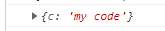

lets clarify one thing right here. if you console is throwing up errors, thats probably because eslint is telling you that are have defined a variable and are not using it. we can change that one of two ways, you can either comment out the line declaring the append function because we are not using it or we can add something to eslintrs.json to fix this. open up the eslintrc.json file and make this modification:

```js
      "react/prop-types": 0,
      "react/react-in-jsx-scope":0,
      "no-console": 0,
      "no-debugger": 1,
      "no-unused-vars": 0
```

the no-unused-vars is the one we are adding. Now you will have to kill webpack and then run an npm start again, but now your console should be clean even with the unused variable declaration.

now everything should be good

- the append function takes in an appendee and returns a function that expects appendix and then just returns the concatenation of the two. so now we can put these guys to use

```js
const maybeA = Maybe.just(a)
  .map(prop('b'))
  .map(prop('c'))
  .map(append(' works perfectly again'))
  .extract();
```

we can remove the test line for prop

```js
// console.log(prop('b')(a));
```

that was just an example, but the code still works fine:

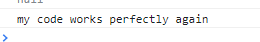

Now, I'm not the biggest fan of this because for me, this might look hard to read. we know that Maybe is holding an a, but a year from now, this might confuse us when we come back to this code. I promise, I will come back and show you an acceptable and much more reabable way, but I figured some people would like this approach.

## branch 4

now, lets add a function that can add a composable feel to our maybes. We'll see what composable in later, and I probably should have shown that first, but we are winging this so, that that. here is our new maybe function

```js
export const Maybe = {
  just: maybe,
  nothing: () => maybe(null),
  chain: (...fns) => (x) => fns.reduce((y, f) => y.map(f), x)
};
```

now lets change our test code:

```js
const appendToC = Maybe.chain(prop('b'), prop('c'), append(' works still'));

const goodInput = Maybe.just({
  b: {
    c: 'my code',
  },
});

const badInput = Maybe.just({});

console.log(appendToC(goodInput).extract());
console.log(appendToC(badInput).extract());
```

just for posteritys sake, your index.js should look liks this now:

```js
console.log('you are ready to start coding...');
import { Maybe } from './Maybe';

const root = document.createElement('div');
root.id = 'root';
document.body.appendChild(root);

const main = document.createElement('div');
const child = document.createElement('p');
child.innerHTML = 'Hello';
main.appendChild(child);
root.appendChild(main);

const maybeNumberOne = Maybe.just(1);
const mappedJust = maybeNumberOne.map((x) => x + 1);
console.log(mappedJust.extract());

const maybeNumberTwo = Maybe.nothing();
const mappedNothing = maybeNumberTwo.map((x) => x + 1);
console.log(mappedNothing.extract());

const prop = (propName) => (obj) => obj[propName];
const append = (appendee) => (appendix) => appendix + appendee;

const appendToC = Maybe.chain(prop('b'), prop('c'), append(' works still'));

const goodInput = Maybe.just({
  b: {
    c: 'my code',
  },
});

const badInput = Maybe.just({});

console.log(appendToC(goodInput).extract());
console.log(appendToC(badInput).extract());

```

and your Maybe.js should look like this:

```js
const isNullOrUndef = (v) => v === null || typeof v === 'undefined';

const maybe = (x) => ({
  isNothing: () => isNullOrUndef(x),
  extract: () => x,
  map: (f) => (!isNullOrUndef(x) ? Maybe.just(f(x)) : Maybe.nothing()),
});

export const Maybe = {
  just: maybe,
  nothing: () => maybe(null),
  chain:
    (...fns) =>
    (x) =>
      fns.reduce((y, f) => y.map(f), x),
};

```

just wanted to clear that up. now our console should look like this:

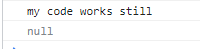

i think this is pretty dope all the way through. hopefully this was all a good understanding of what you can really do with this wil actual real data, but if not, we'll look at that too in the next branch

## branch 5

i know so far, we have written everything from scratch and thats what I like to see, but now, i have to be that guy and ask that you copy some fake data from this repo. grab the data.js file and put it in your local project. theres no need for you to type all this out, or you can go rambo and create your own data and try to follow along like that.

here is the data:

```js
export const data = [
  {
    upc: '4011',
    description: 'bananas',
    dept: 5,
    deptDescription: 'Produce',
    category: 11,
    categoryDescription: 'produce',
    price: 0.69,
    qty: 1,
    isWeightRequired: false,
    pack: 'each',
    tprPrice: 0,
    tprStartDate: '',
    tprEndDate: '',
    vendorId: 'PROD',
    vendorCode: 425794,
    uom: 'C',
    baseCost: 0.5,
    case: 1,
  },
  {
    upc: '00000000000117',
    description: 'SnapCrack Treats ',
    dept: 32,
    deptDescription: 'Soda/Candy',
    category: 4,
    categoryDescription: 'CANDY & GUM',
    price: 1.1,
    qty: 1,
    isWeightRequired: false,
    pack: 'each',
    tprPrice: 1.05,
    tprStartDate: '5/8/2022',
    tprEndDate: '5/14/2022',
    vendorId: 'ABC',
    vendorCode: 325794,
    uom: 'C',
    baseCost: 0.99,
    case: 1,
  },
  {
    upc: '00000000000118',
    description: 'Twizzlers',
    dept: 32,
    deptDescription: 'Soda/Candy',
    category: 4,
    categoryDescription: 'CANDY & GUM',
    price: 2.65,
    qty: 1,
    isWeightRequired: false,
    pack: 'each',
    tprPrice: 1.89,
    tprStartDate: '9/1/2022',
    tprEndDate: '9/30/2022',
    vendorId: 'ABC',
    vendorCode: 325694,
    uom: 'C',
    baseCost: 1.99,
    case: 1,
  },
  {
    upc: '00000000000119',
    description: 'Rolos',
    dept: 32,
    deptDescription: 'Soda/Candy',
    category: 4,
    categoryDescription: 'CANDY & GUM',
    price: 1.79,
    qty: 1,
    isWeightRequired: false,
    pack: 'each',
    tprPrice: 1.69,
    tprStartDate: '9/1/2022',
    tprEndDate: '9/30/2022',
    vendorId: 'ABC',
    vendorCode: 325793,
    uom: 'C',
    baseCost: 1.69,
    case: 1,
  },
  {
    upc: '00000000000120',
    description: 'Gummie Bears',
    dept: 32,
    deptDescription: 'Soda/Candy',
    category: 4,
    categoryDescription: 'CANDY & GUM',
    price: 2.1,
    qty: 1,
    isWeightRequired: false,
    pack: 'each',
    tprPrice: 1.69,
    tprStartDate: '',
    tprEndDate: '',
    vendorId: 'ABC',
    vendorCode: 325694,
    uom: 'C',
    baseCost: 2.05,
    case: 1,
  },
  {
    upc: '0006414428243',
    description: 'ROTEL DC TOM/GR CHL ',
    dept: 1,
    deptDescription: 'Grocery',
    category: 3,
    categoryDescription: 'BAKING NEEDS',
    price: 1.49,
    qty: 1,
    isWeightRequired: false,
    pack: 'each',
    tprPrice: 1.29,
    tprStartDate: '4/13/2022',
    tprEndDate: '9/1/2022',
    vendorId: '',
    vendorCode: null,
    uom: '',
    baseCost: 0,
    case: 1,
  },
  {
    upc: '0006414428263',
    description: 'ROTEL MLD TOM GR CHL 10 OZ',
    dept: 1,
    deptDescription: 'Grocery',
    category: 3,
    categoryDescription: 'BAKING NEEDS',
    price: 1.49,
    qty: 1,
    isWeightRequired: false,
    pack: 'each',
    tprPrice: 1.29,
    tprStartDate: '4/13/2022',
    tprEndDate: '9/1/2022',
    vendorId: '',
    vendorCode: null,
    uom: '',
    baseCost: 0,
    case: 1,
  },
  {
    upc: '0006414428266',
    description: 'ROTEL X HOT DC TOM 10 OZ',
    dept: 1,
    deptDescription: 'Grocery',
    category: 3,
    categoryDescription: 'BAKING NEEDS',
    price: 1.49,
    qty: 1,
    isWeightRequired: false,
    pack: 'each',
    tprPrice: 1.29,
    tprStartDate: '4/13/2022',
    tprEndDate: '9/1/2022',
    vendorId: '',
    vendorCode: null,
    uom: '',
    baseCost: 0,
    case: 1,
  },
  {
    upc: '0001760008102',
    description: 'CASA TACO SHELLS 4.5 OZ',
    dept: 1,
    deptDescription: 'Grocery',
    category: 9,
    categoryDescription: 'COOKIES - CRACKERS - MISCELLAN',
    price: 2.19,
    qty: 1,
    isWeightRequired: false,
    pack: 'each',
    tprPrice: 0,
    tprStartDate: '0',
    tprEndDate: '0',
    vendorId: '00050',
    vendorCode: 112345,
    uom: 'U',
    baseCost: 1.99,
    case: 1,
  },
  {
    upc: '0001760008120',
    description: 'CASA TACO DINNER 9.75 OZ',
    dept: 1,
    deptDescription: 'Grocery',
    category: 9,
    categoryDescription: 'COOKIES - CRACKERS - MISCELLAN',
    price: 2.79,
    qty: 1,
    isWeightRequired: false,
    pack: 'each',
    tprPrice: 0,
    tprStartDate: '0',
    tprEndDate: '0',
    vendorId: '00050',
    vendorCode: 112344,
    uom: 'U',
    baseCost: 2.59,
    case: 1,
  },
  {
    upc: '0001760008122',
    description: 'CASA TACO SEASONING 1.25 OZ',
    dept: 1,
    deptDescription: 'Grocery',
    category: 9,
    categoryDescription: 'COOKIES - CRACKERS - MISCELLAN',
    price: 0.79,
    qty: 1,
    isWeightRequired: false,
    pack: 'each',
    tprPrice: 0,
    tprStartDate: '0',
    tprEndDate: '0',
    vendorId: '00050',
    vendorCode: 112343,
    uom: 'U',
    baseCost: 0.59,
    case: 1,
  },
  {
    upc: '0001760008557',
    description: 'CASA TACO SALAD SEAS 1.25 OZ',
    dept: 1,
    deptDescription: 'Grocery',
    category: 9,
    categoryDescription: 'COOKIES - CRACKERS - MISCELLAN',
    price: 1.69,
    qty: 1,
    isWeightRequired: false,
    pack: 'each',
    tprPrice: 0,
    tprStartDate: '0',
    tprEndDate: '0',
    vendorId: '00050',
    vendorCode: 112342,
    uom: 'U',
    baseCost: 1.29,
    case: 1,
  },
  {
    upc: '0020000400000',
    description: 'Carnitas',
    dept: 9,
    deptDescription: 'Meat',
    category: 6198,
    categoryDescription: 'MISC SIDE MEATS',
    price: 1.99,
    qty: 1,
    isWeightRequired: true,
    pack: 'each',
    tprPrice: 0,
    tprStartDate: '0',
    tprEndDate: '0',
    vendorId: '00050',
    vendorCode: 221456,
    uom: 'U',
    baseCost: 0.99,
    case: 1,
  },
  {
    upc: '0020000600000',
    description: 'Barbacoa',
    dept: 9,
    deptDescription: 'Meat',
    category: 6198,
    categoryDescription: 'MISC SIDE MEATS',
    price: 3.59,
    qty: 1,
    isWeightRequired: true,
    pack: 'each',
    tprPrice: 0,
    tprStartDate: '0',
    tprEndDate: '0',
    vendorId: '00050',
    vendorCode: 190263,
    uom: 'U',
    baseCost: 2.59,
    case: 1,
  },
];

```

as you can see, these are just a bunch of grocery items that you might expect to get back from an api request to a remote server.

let see how we can manipulate this data. lets just first bring the data into a maybe and make sure that works and then we can build on top of that.

```js
import { data } from './data';

const maybeData = Maybe.just(data).extract();
console.log(maybeData);
```

I hope you think thats cool, because I do, we have all the data in the console

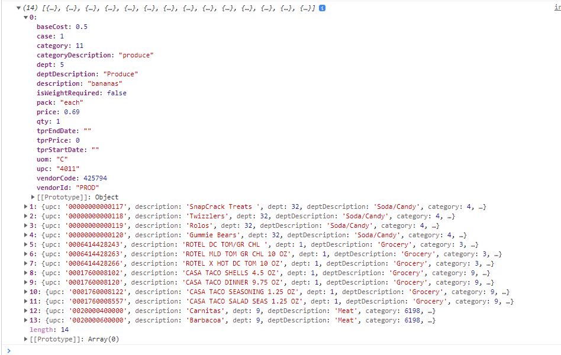

now, lets really do something with it. if we look at this data, then maybe we want everything in dept 32 that has a price of more than 2.00. lets see how that looks, shall we:

```js
const maybeData = Maybe.just(data)
  .map((x) => x.filter((i) => i.dept === 32))
  .extract();
console.log(maybeData);
```

sweet, now we are down to 4 items:

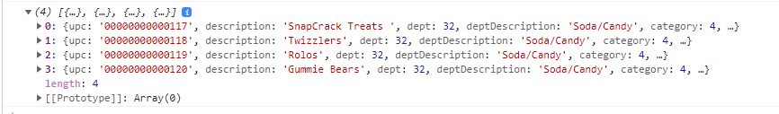

now lets get the items that have a price of more than 2 dollars:

```js
const maybeData = Maybe.just(data)
  .map((x) => x.filter((i) => i.dept === 32))
  .map((x) => x.filter((i) => i.price > 2))
  .extract();
console.log(maybeData);
```

even cooler, now we are down to 2 items. lets also talk really quickly about, what if we actually do not get data from the server. what does that look like:

```js
const maybeData = Maybe.just(null)
  .map((x) => x.filter((i) => i.dept === 32))
  .map((x) => x.filter((i) => i.price > 2))
  .extract();
console.log(maybeData);
```

notice that we just get a null, we have run two map functions over the input to the maybe and nothing broke. if we tried to run a filter command with undefined as the source of the data to be filtered, we would have a red console. what does that look like exactly:

```js
console.log(null.filter((i) => i.dept === 32));
```

not such a great outcome, so , let's put our data back in and look at these items that we have so far: oh, and remove that last line for testing of course

```js
const maybeData = Maybe.just(data)
  .map((x) => x.filter((i) => i.dept === 32))
  .map((x) => x.filter((i) => i.price > 2))
  .extract();
console.log(maybeData);
```

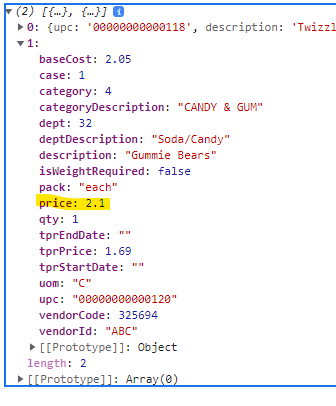

let fix that price as well. to do this, we are going to create a file called utils.js and add this function to it:

```js
export const formatMoney = (x) => {
  x = x.toString();
  const pos = x.indexOf('.');
  const left = x.substring(0, pos);
  let right = x.substring(pos + 1);
  if (right.length === 1) {
    right = right + '0';
  }
  return `${left}.${right}`;
};
```

now we can add this to our mapping

```js
import { formatMoney } from './utils';

const maybeData = Maybe.just(data)
  .map((x) => x.filter((i) => i.dept === 32))
  .map((x) => x.filter((i) => i.price > 2))
  .map((x) => x.map((i) => ({ ...i, price: formatMoney(i.price) })))
  .extract();
console.log(maybeData);
```

now, if we look at our items, all looks good:

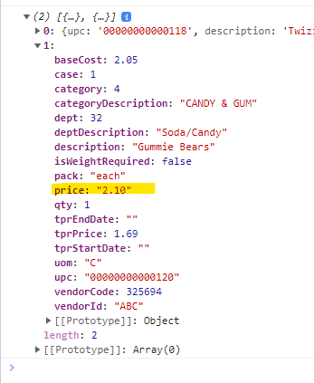

so, thats basically how I  would use this. I can easily read the function and tell exactly what is doing. for example, if I thought that the item had a dept and it didnt, then normally that blows up my code, but if its not there in this scenario, its not a problem. 

## branch 7

Now we are going to create an api and see what it looks like to get data from our api. lets bring up our terminal and run this command:

First, though, we want to install a plugin in vscode, so go to the extensions and install this plugin:

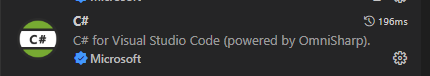

```js
dotnet new webapi -n myapi
```

that should create a new folder in our project called myapi

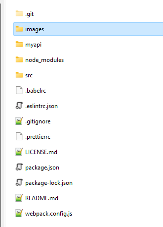

Now let's open this up in vscode and make some changes to it

what you should see is a prompt at the bottom of the screen asking you this

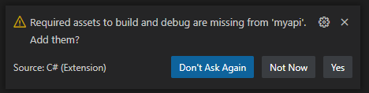

You should definately press yes. This will allow us to debug our code property with swagger to make sure that it all works.

The first thing we are going to need to do is make sure this app will run. Lets open the debugger:

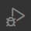

This is found in the menu on the left of the screen in vscode. If we run the debugger:

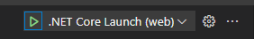

if we run this debugger, we get a rather confusing web page:

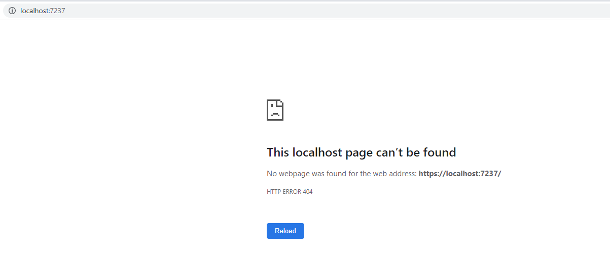

but if we navigate to the swagger part, we'll start to see something amazing:

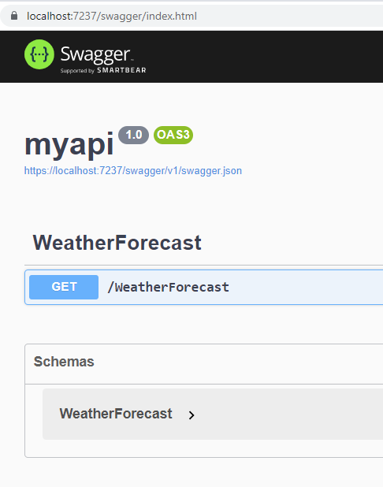

Now this is nice to see, but how can we use it?. We'll cover that now.

Let's make sure that we have SQL or SQLExpress installed. You can find a download [link here](https://www.microsoft.com/en-us/download/details.aspx?id=101064)

Once you have all that installed, let's open SSMS andcreate a new database


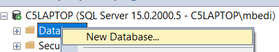

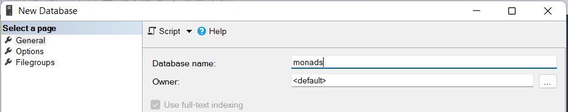

then press ok to create the new database

now, lets create a new table

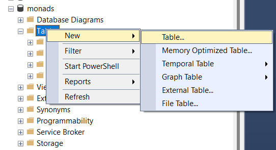

I like to always add an id with the identity specification enabled

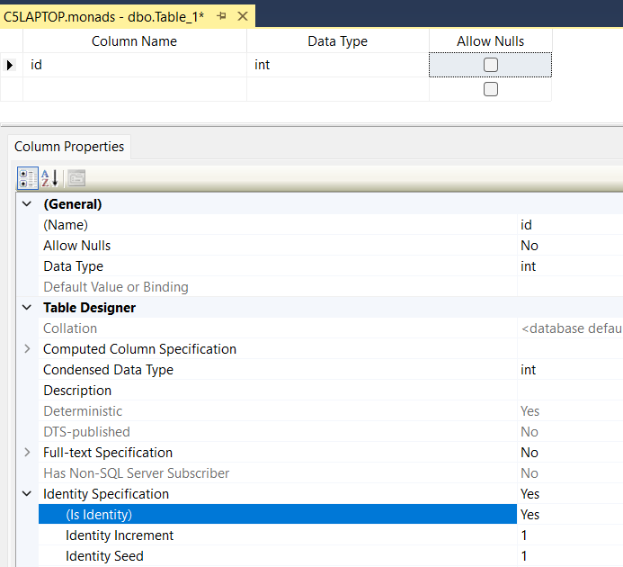

we are going to fill out the table like so:

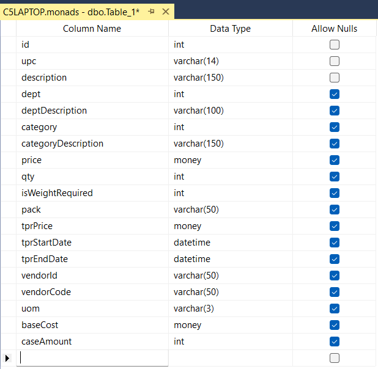

save the table and name it products

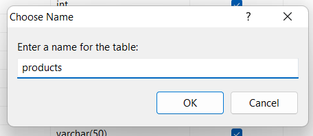

you may have to right click on tables and select refresh and then your db structure should look like this:

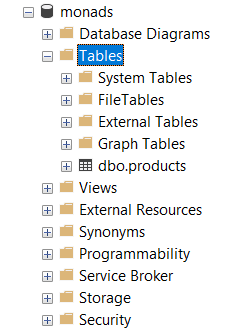

Now we are going to create a new query and paste this code in

```js
insert into products(upc, description, dept, deptDescription, category, categoryDescription, price, qty, isWeightRequired, 
pack, tprPrice, tprStartDate, tprEndDate, vendorid, vendorCode, uom, baseCost, caseAmount) values 
('4011', 'bananas', 5, 'Produce', 11, 'produce', .69, 1, 0, 'each', 0, '', '', 'PROD', 425794, 'C', .5, 1);

insert into products(upc, description, dept, deptDescription, category, categoryDescription, price, qty, isWeightRequired, 
pack, tprPrice, tprStartDate, tprEndDate, vendorid, vendorCode, uom, baseCost, caseAmount) values 
('00000000000117', 'SnapCrack Treats', 32, 'Soda/Candy', 4, 'CANDY AND GUM', 1.1, 1, 0, 'each', 1.05, '5/8/2022', '5/14/2022', 'ABC', 325794, 'C', .99, 1);

insert into products(upc, description, dept, deptDescription, category, categoryDescription, price, qty, isWeightRequired, 
pack, tprPrice, tprStartDate, tprEndDate, vendorid, vendorCode, uom, baseCost, caseAmount) values 
('00000000000118', 'Twizzlers', 32, 'Soda/Candy', 4, 'CANDY AND GUM', 2.65, 1, 0, 'each', 1.89, '9/1/2022', '9/30/2022', 'ABC', 325795, 'C', 1.99, 1);

insert into products(upc, description, dept, deptDescription, category, categoryDescription, price, qty, isWeightRequired, 
pack, tprPrice, tprStartDate, tprEndDate, vendorid, vendorCode, uom, baseCost, caseAmount) values 
('00000000000119', 'Rolos', 32, 'Soda/Candy', 4, 'CANDY AND GUM', 1.79, 1, 0, 'each', 1.69, '9/1/2022', '9/30/2022', 'ABC', 325793, 'C', 1.69, 1);

insert into products(upc, description, dept, deptDescription, category, categoryDescription, price, qty, isWeightRequired, 
pack, tprPrice, tprStartDate, tprEndDate, vendorid, vendorCode, uom, baseCost, caseAmount) values 
('00000000000120', 'Gummie Bears', 32, 'Soda/Candy', 4, 'CANDY AND GUM', 2.1, 1, 0, 'each', 1.69, '', '', 'ABC', 325693, 'C', 2.05, 1);

insert into products(upc, description, dept, deptDescription, category, categoryDescription, price, qty, isWeightRequired, 
pack, tprPrice, tprStartDate, tprEndDate, vendorid, vendorCode, uom, baseCost, caseAmount) values 
('0006414428243', 'ROTEL DC TOM/GR CHL', 1, 'Grocery', 3, 'BAKING NEEDS', 1.49, 1, 0, 'each', 1.29, '4/13/2022', '9/1/2022', '', null, '', 0, 1);

insert into products(upc, description, dept, deptDescription, category, categoryDescription, price, qty, isWeightRequired, 
pack, tprPrice, tprStartDate, tprEndDate, vendorid, vendorCode, uom, baseCost, caseAmount) values 
('0006414428263', 'ROTEL MLD TOM GR CHL 10 OZ', 1, 'Grocery', 3, 'BAKING NEEDS', 1.49, 1, 0, 'each', 1.29, '4/13/2022', '9/1/2022', '', null, '', 0, 1);

insert into products(upc, description, dept, deptDescription, category, categoryDescription, price, qty, isWeightRequired, 
pack, tprPrice, tprStartDate, tprEndDate, vendorid, vendorCode, uom, baseCost, caseAmount) values 
('0001760008102', 'CASA TACO SHELLS 4.5 OZ', 1, 'Grocery', 9, 'COOKIES - CRACKERS - MISCELLAN', 2.10, 1, 0, 'each', 0, '', '', '00050', 112345, 'U', 1.99, 1);

insert into products(upc, description, dept, deptDescription, category, categoryDescription, price, qty, isWeightRequired, 
pack, tprPrice, tprStartDate, tprEndDate, vendorid, vendorCode, uom, baseCost, caseAmount) values 
('0001760008120', 'CASA TACO DINNER 9.75 OZ', 1, 'Grocery', 9, 'COOKIES - CRACKERS - MISCELLAN', 2.79, 1, 0, 'each', 0, '', '', '00050', 112344, 'U', 2.59, 1);

insert into products(upc, description, dept, deptDescription, category, categoryDescription, price, qty, isWeightRequired, 
pack, tprPrice, tprStartDate, tprEndDate, vendorid, vendorCode, uom, baseCost, caseAmount) values 
('0001760008122', 'CASA TACO SEASONING 1.25 OZ', 1, 'Grocery', 9, 'COOKIES - CRACKERS - MISCELLAN', .79, 1, 0, 'each', 0, '', '', '00050', 112343, 'U', .59, 1);

insert into products(upc, description, dept, deptDescription, category, categoryDescription, price, qty, isWeightRequired, 
pack, tprPrice, tprStartDate, tprEndDate, vendorid, vendorCode, uom, baseCost, caseAmount) values 
('0001760008557', 'CASA TACO SALAD SEAS 1.25 OZ', 1, 'Grocery', 9, 'COOKIES - CRACKERS - MISCELLAN', 1.69, 1, 0, 'each', 0, '', '', '00050', 112342, 'U', 1.29, 1);

insert into products(upc, description, dept, deptDescription, category, categoryDescription, price, qty, isWeightRequired, 
pack, tprPrice, tprStartDate, tprEndDate, vendorid, vendorCode, uom, baseCost, caseAmount) values 
('0020000400000', 'Carnitas', 9, 'Meat', 6198, 'MISC SIDE MEATS', 1.99, 1, 1, 'each', 0, '', '', '00050', 221456, 'U', .99, 1);

insert into products(upc, description, dept, deptDescription, category, categoryDescription, price, qty, isWeightRequired, 
pack, tprPrice, tprStartDate, tprEndDate, vendorid, vendorCode, uom, baseCost, caseAmount) values 
('0020000600000', 'Barbacoa', 9, 'Meat', 6198, 'MISC SIDE MEATS', 3.59, 1, 1, 'each', 0, '', '', '00050', 190263, 'U', 2.59, 1);


```

and if you create a new query and run

```js
select * from products
```

you should see this:

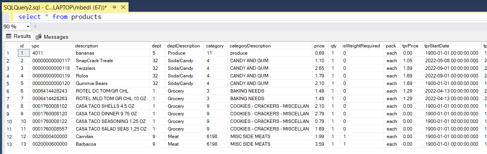

we are going to stop here for now and in the next branch, we'll setup some security and hook our database into our api that we created earlier

## branch 8

lets setup a user in our sql database so we can use that userid in our api:

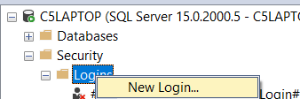

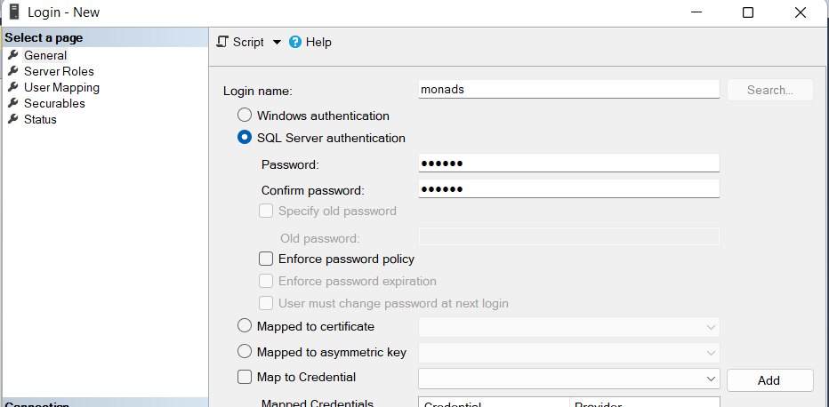


one thing we need to check is that you have your server setup for mixed mode. go to the properties of your sql server

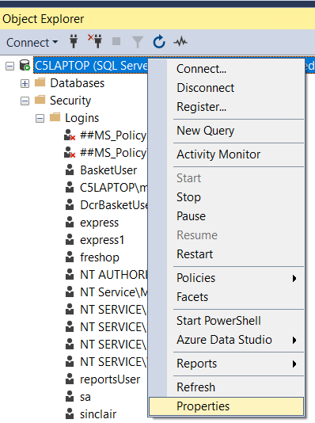


if you need to change this you will have to restart your sql server. if this setting is ot set to this mode, then none of the things we are going to do next will work

double check that you can login and get to your database tables using this new login

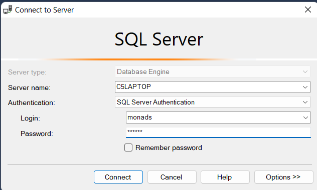

Now, lets open up our api project in vscode and add a file to the root called DbUtils.cs

```js
namespace myapi;

public static class DbUtils
{
  public static string GetConnectionString(IConfiguration config)
  {
    string server = config["DB:server"];
    string database = config["DB:database"];
    string username = config["DB:username"];
    string password = config["DB:password"];
    string connectionString = "Data Source=" + server + ";Initial Catalog=" + database + ";User Id=" + username + ";Password=" + password + ";TrustServerCertificate=true";
    return connectionString;
  }
}
```

there are a few more things that we have to do to get this to work. lets update our config file, so open the appsettings.json file and add this section:

```js
{
  "Logging": {
    "LogLevel": {
      "Default": "Information",
      "Microsoft.AspNetCore": "Warning"
    }
  },
  "AllowedHosts": "*",
  "DB":{
    "server":"C5Laptop",
    "database":"monads",
    "username":"monads",
    "password":"monads"
  }
}
```

normally I would encrypt all of this, but we will leave that for another day.Obviously, you will need to use the name of your server, and other stuff if you created it differently.

now we need to install a package into  our api so we can access sql server. bring up the terminal and type this command:

```js
dotnet add package Microsoft.Data.SqlClient
```

now, we should actually be able to get something started. lets create a new controller in the controllers folder called TestController.cs

```js
namespace myapi.Controllers;

public class TestController: ControllerBase
{
  
}
```

at this point, you will probably see that ControllerBase has a red squiggly under it so put your cursor inside that work and press CTRL-.

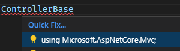

click on that and it will import the proper using statement for your. now lets finish our class

```js
using Microsoft.AspNetCore.Mvc;

namespace myapi.Controllers;

[ApiController]
[Route("test")]
public class TestController: ControllerBase
{
  private readonly IConfiguration _config;

  public TestController(IConfiguration config)
  {
    _config = config;
  }
}
```

after you add the _config = config, you can put your cursor in the _config work and press CTRL-. to create the private read-only variable.

now lets create two routes to test our service and db connection: now the whole file should look like this

```js
using Microsoft.AspNetCore.Mvc;
using Microsoft.Data.SqlClient;

namespace myapi.Controllers;

[ApiController]
[Route("test")]
public class TestController : ControllerBase
{
  private readonly IConfiguration _config;

  public TestController(IConfiguration config)
  {
    _config = config;
  }

  [HttpGet]
  [Route("testservice")]
  public ActionResult TestService()
  {
    try
    {
      return Ok(new
      {
        error = 0,
        success = true,
        msg = "Test success"
      });
    }
    catch (System.Exception ex)
    {
      return Ok(new
      {
        error = 1,
        success = false,
        msg = ex.Message
      });
    }
  }

  [HttpGet]
  [Route("testdb")]
  public ActionResult TestDb()
  {
    try
    {
      using (SqlConnection conn = new SqlConnection(DbUtils.GetConnectionString(_config)))
      {
        conn.Open();
        conn.Close();
      }

      return Ok(new
      {
        error = 0,
        success = true,
        msg = "Test db success"
      });
    }
    catch (System.Exception ex)
    {
      return Ok(new
      {
        error = 1,
        success = false,
        msg = ex.Message
      });
    }
  }
}
```

we are ready to test this thing finally

press F5 and then navigate to the /swagger route and it should look like this:

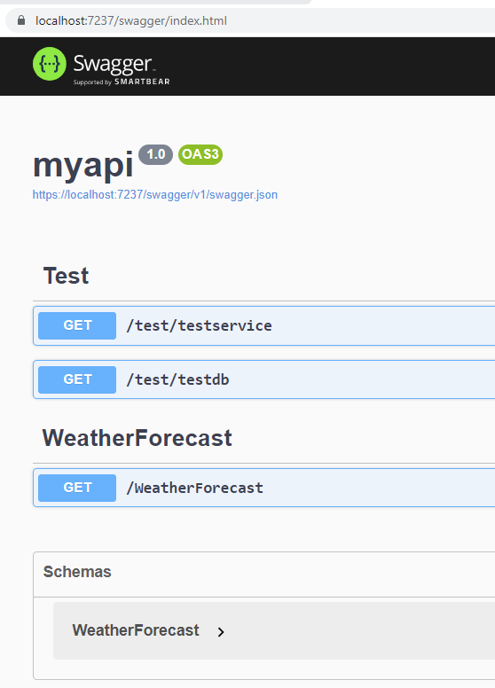

open up the test and click 'Try it out', then press execute and you should see this

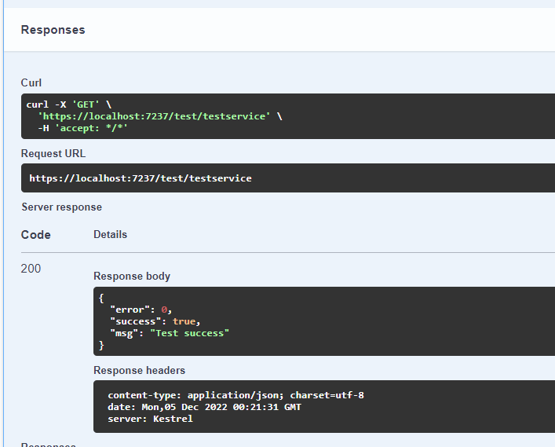

now lets try the same thing with testdb

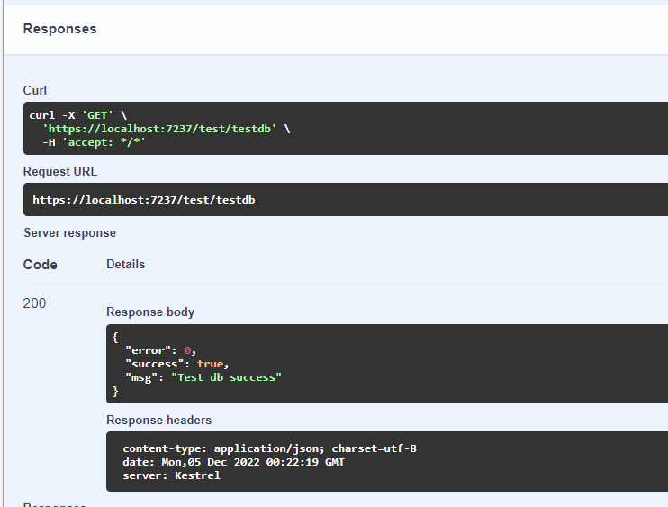

we are going to close this branch with that and in the next branch, we'll create an actual endpoint to use and wire that up