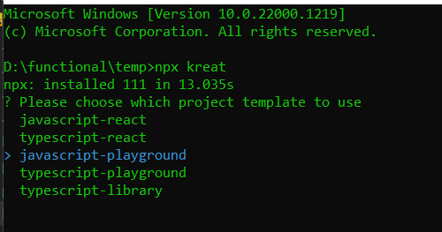
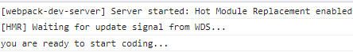
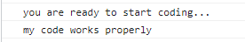
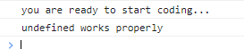
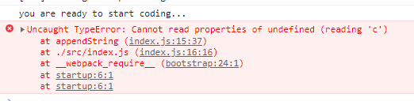
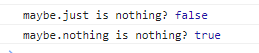
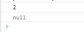

# js-monads

here we are going to take a look at a few monads

lets create a folder in our programming folder and call it js-monads

bring up the command prompt in the folder and type

```js
npx kreat
```

you should see this:



Im choosing javascript playground for this repo. then just answer the questions for if you want as git repo and if you want to install the dependencies. I would suggest at least for installing the dependencies as you are going to have to do that at some point.

now you can open that project in vscode.

now lets bring up the terminal and type 

```js
npm start
```

you should be presented with this in the console after webpack starts up



## branch 1

### Maybe monad

lets firt start with a problem. say we had this code:

```js
const a = {
  b: {
    c: 'my code',
  },
};

const appendString = (obj) => obj.b.c + ' works properly';
const result = appendString(a);
console.log(result);

```

save it and your web console should look like this:



now what happens if say we remove c

```js
const a = {
  b: {},
};
```

ok, it doesnt entirely break, but it looks kind of strange, right:



if we ask a for is b child, now problem, but when we ask b for its c child its just undefined and thats actually not really a problem per say. the code will still work, you just wont get the wished for outcome, right?

now, what happens if we remove b

```js
const a = {};
```

ok, now we really have a problem:



if we ask a for its b child, its not there. no problem. but if we try to ask b for its c child, well, b is not there and therefore has no children so things will start to blow up.

so, how do we solve for this problem? bring in the Maybe monad.

lets create a file called Maybe.js

we are first going to start out with some helper functions

```js
const isNullOrUndef = (v) => v === null || typeof v === 'undefined';

const maybe = (x) => ({
  isNothing: () => isNullOrUndef(x),
  extract: () => x
})
```

lets start out with a simple factory function like so:

```js
export const Maybe = {
  just: maybe,
  nothing: () => maybe(null),
};
```

we will start with that and then come back later and add some more functions to it.

first let's test it out and see if everything works, so in our index.js file, lets add this:

at the top of the file, lets import our Maybe function

```js
import { Maybe } from './Maybe';
```

then ad the end of the file, lets write some testing code

```js
const maybeNumberOne = Maybe.just(1);
const maybeNumberTwo = Maybe.nothing();

console.log('maybe.just is nothing?', maybeNumberOne.isNothing());
console.log('maybe.nothing is nothing?', maybeNumberTwo.isNothing());
```

now we should see this in our console.



lets commit what we have so far, and we'll continue in the next branch.

## branch 2

lets get rid of this code, but we'll come back to it later

```js
const a = {
  b: {
    c: 'my code',
  },
};

const appendString = (obj) => obj.b.c + ' works properly';
const result = appendString(a);
console.log(result);
```

now lets add some functionality to this maybe character so we can actually start to do things

```js
const maybe = (x) => ({
  isNothing: () => isNullOrUndef(x),
  extract: () => x,
  map: (f) => (!isNullOrUndef(x) ? Maybe.just(f(x)) : Maybe.nothing()),
});
```

so when we map, if there is something thats mappable, we just return a new maybe and execute the map function of the value that the maybe is holding for us. if the value inside the maybe cant be mapped, we just return a nothing, so this way, nothing ever breaks

now let's modify our testing like so:

```js
const maybeNumberOne = Maybe.just(1);
const mappedJust = maybeNumberOne.map((x) => x + 1);
console.log(mappedJust.extract());

const maybeNumberTwo = Maybe.nothing();
const mappedNothing = maybeNumberTwo.map((x) => x + 1);
console.log(mappedNothing.extract());
```

and then lets remove this code

```js
console.log('maybe.just is nothing?', maybeNumberOne.isNothing());
console.log('maybe.nothing is nothing?', maybeNumberTwo.isNothing());
```

now, we should see this in the console:



so, when we mapped over the first maybe that was holding a 1, we just added 1 to it, but when we mapped over the second maybe that was holding nothing, nothing broke. all is well in the world.

now that we seen that we can map, we can bring back in a version of our origin problem and see how maybe solves that problem of things blowing up.

```js
const a = {
  b: {
    c: 'my code',
  },
};

const maybeA = Maybe.just(a)
  .map((a) => a.b)
  .map((b) => b.c)
  .map((c) => c + ' works perfectly')
  .extract();

console.log(maybeA);
```

now your console should be printing our that you code works perfectly again, and we can run our tests where we remove c

```js
const a = {
  b: {},
};
```

you should just see null in the console, and now if we remove b

```js
const a = {};
```

still just getting null, and we know from previously, that this would have blown up our console.
